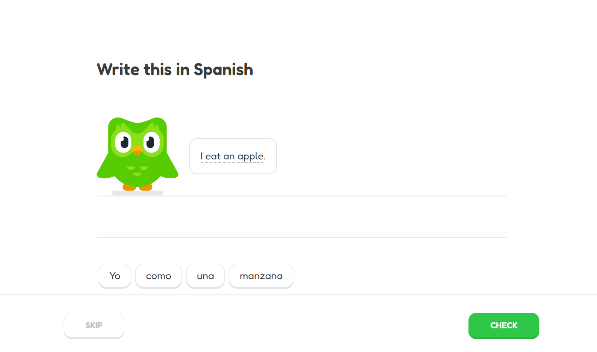

# Duolingo Click On Words Exercise

_I am a huge fan of Duolingo and I use it daily to learn Spanish. As a challenge, I decided to recreate the Duolingo Click On Words Exercise UI with plain HTML5, CSS3 and Vanilla Javascript._

Note: This is made for educational purpose only. This project **will not** be used for commercial use.

## Demo

[Live Demo](https://kasratabrizi.github.io/duolingo-exercise-project/)

## Goal

The goal is to try to recreate the UI/UX but also the logic as close as Duolingo's version.

## User Story

- As user you get an English sentence which you have to translate into Spanish.
- At the bottom of the page I get a list of randomly ordered words in Spanish.
- Clicking on a word, will move it to an upper empty space.
- By clicking the correct words in the correct order, you can form the translated version of the given sentence.
- Not all words from the list are needed to form the sentence. This will give an extra challenge to the user.
- When you accidently selected the wrong word, by clicking on the word again, it will move back to its original position.
- The other selected words will slide to the left to fill the empty space.
- When ready, clicking on the **Check** button will verify whether your formed sentence is correct or not. Clicking on the **Skip** Button, will skip to the next exercise.

## Screenshot of the UI from Duolingo

## Screenshot of my version

**Note that this is what I have so far. When I have a new update, I will post a new gif**

## TODO

### HTML

- [x] Write the basic boiler plate HTML
- [x] Add header 1 tag to describe the assigment
- [ ] Add a progress bar at the top in HTML
- [x] Add an Duolingo Image
- [x] Add a speech bubble with the sentence
- [x] Add a destination div where the words should move to to form the sentence
- [x] Add a list of words div where you can select the words to forn the sentence
- [x] Add word div in the list of words div
- [x] Add a footer tag
- [x] Add a Skip Button in the footer
- [x] Add a Check button in the footer

### CSS

- [ ] Add a CSS reset
- [x] Style header 1 tag
- [ ] Style progress bar at the top in HTML
- [x] Style the Duolingo Image
- [ ] Style the Speech Bubble
- [x] Add Dashed border to each word in the Speech Bubble
- [x] Style the destination div
- [x] Style list of words div
- [x] Style the word div
- [ ] Add a placeholder div for the word when you move it.
- [ ] Make it Mobile Responsive
- [ ] Make it Tablet Responsive
- [x] Style footer tag
- [x] Style a Skip Button in the footer
- [x] Style a Check button in the footer

### Javascript

- [x] Create necessary variables of all the tags, classes and id's
- [x] Randomize the order of the list of words
- [x] Add other words in the list that are not going to be used
- [x] Create an eventlistener for each word
- [x] Calculate the distance each word needs to travel
- [x] Make sure the words go back to their original position when clicked on them again.
- [ ] Slide the other selected words to the left to fill empty space of a words that goes back to its original position.
- [ ] Make everything as modular as possible. (DRY method)
- [ ] Refactor and clean
- [x] Add comments where necessary
- [ ] Play audio of a word when hovering over a word with a dashed bottom border
- [x] Pick a random exercise
